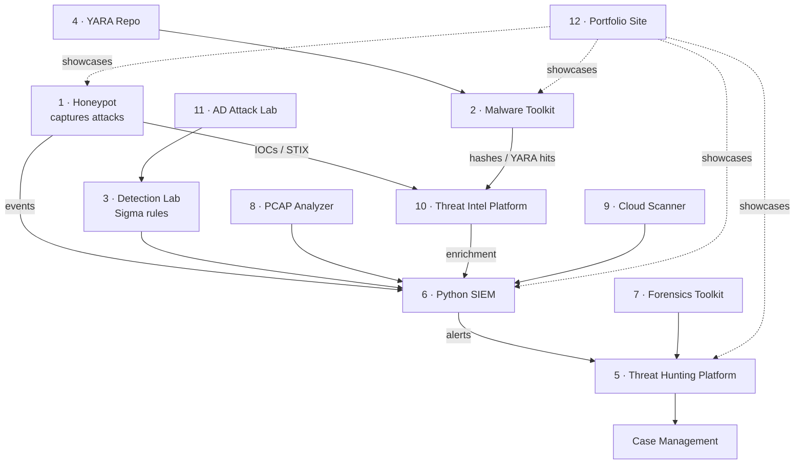

# 🛡️ Enterprise Security Operations (SOC) Portfolio

Hi, I'm **Kristion Jones** — I build **blue-team / detection-engineering**
tooling. This repository is a single, integrated security ecosystem: each
project produces data the next one consumes, mirroring how a real Security
Operations Center is wired together.

Every project here is held to one standard — **production-quality, not toy
demos**: real code, unit tests, documentation, architecture diagrams, Docker
support where it fits, GitHub Actions CI, and an MIT license.

> 📌 This portfolio is **built incrementally, one solid project at a time.**
> The table below reflects true status — shipped projects are linked and
> tested; the rest are on the roadmap and will be filled in as they're built.

---

## 🗺️ The ecosystem

The throughline: **the honeypot generates real attack data → indicators flow
into the threat-intel platform and SIEM → detections (Sigma/YARA) fire alerts →
analysts hunt, triage, and investigate.**

## 📦 Projects

| # | Project | What it does | Status |
|---|---------|--------------|--------|
| 1 | [**Network Honeypot + Dashboard**](projects/01-honeypot) | Multi-port sensor, live dashboard, JSON API, geolocation, IOC/STIX export, Docker | ✅ **Live** — 33 tests, 88% cov |
| 2 | Malware Analysis Toolkit | PE/ELF parsing, entropy, strings, imports, hashing, YARA, PDF reports | 🧭 Planned |
| 3 | Detection Engineering Lab | 100 Sigma rules (Windows/Linux/PowerShell/LOLBins) + ATT&CK mappings | 🧭 Planned |
| 4 | YARA Repository | 100+ rules: ransomware, trojans, loaders, stealers, web shells + test samples | 🧭 Planned |
| 5 | Threat Hunting Platform | Hunt queries, IOC search, timeline, risk scoring, ATT&CK matrix | 🧭 Planned |
| 6 | Python SIEM | Log ingestion, correlation, alerting, enrichment, search, case management | 🧭 Planned |
| 7 | Digital Forensics Toolkit | Disk/registry/browser analysis, timeline, file recovery, evidence hashing | 🧭 Planned |
| 8 | PCAP Network Analyzer | DNS/HTTP/TLS analysis, port-scan & beacon detection | 🧭 Planned |
| 9 | Cloud Security Scanner | AWS/Azure/GCP IAM, public buckets, MFA, logging, CIS scoring | 🧭 Planned |
| 10 | Threat Intelligence Platform | IOC database, VirusTotal/OTX, URL scanning, reputation, dashboard | 🧭 Planned |
| 11 | Active Directory Attack Lab | Detect Kerberoasting, PtH, Golden Ticket, DCSync, BloodHound paths | 🧭 Planned |
| 12 | Portfolio Website | Showcase site linking every project, diagrams, and demos | 🧭 Planned |

## ⭐ Featured: Sentinel Honeypot

A low-interaction honeypot that emulates SSH, Telnet, HTTP, MySQL, SMB, Redis
and more across many ports, records every connection attempt, and exports
observed indicators to **CSV / JSON / STIX 2.1** for SIEM and threat-intel
ingestion. Live dashboard, JSON API, Dockerized, CI-tested.
**→ [Explore the project](projects/01-honeypot)**

## 🧰 Tech & focus areas

`Python` · `Flask` · `SQLite` · `Docker` · `GitHub Actions` · `pytest`
`MITRE ATT&CK` · `Sigma` · `YARA` · `STIX/TAXII` · `Threat Intelligence`
`Detection Engineering` · `Blue Team` · `SOC Operations`

## 📫 Contact

- 📧 kriskennesaw@gmail.com
- 💼 Open to **SOC Analyst · Detection/Threat Engineer · Malware Analyst · Blue Team** roles

---

Built for learning and demonstration. Security tooling here is for
authorized, defensive use only. All projects MIT-licensed.
