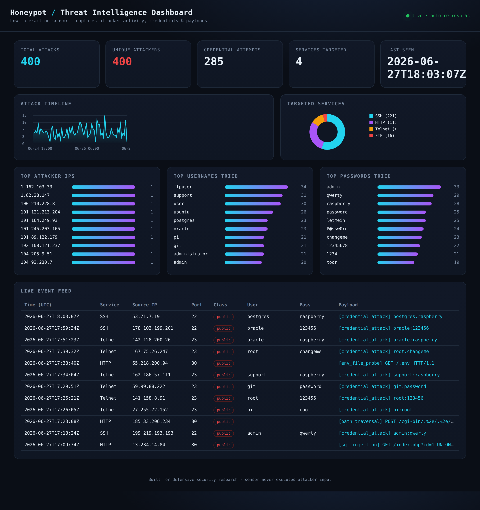

<h1 align="center">👋 Hi, I'm Kristion Jones</h1>
<p align="center">
  <b>Cybersecurity / Blue Team</b> &middot; honeypots &middot; malware analysis &middot; detection engineering
</p>

<p align="center">
  
  
  
  
</p>

---

I build hands-on security tooling across the **blue-team stack** — from collecting
live attacker telemetry, to analyzing malware, to writing the detections that
catch it. Everything in this repository is real, runs locally, and is documented
so you can reproduce it. 👇

## 🔐 Featured Security Projects

### 🍯 [Honeypot + Threat Intelligence Dashboard](honeypot-dashboard)
A low-interaction honeypot that emulates SSH/HTTP/Telnet/FTP, captures attacker
IPs, sprayed **credentials**, and exploit payloads — paired with a **live web
dashboard**. Zero third-party dependencies.



`Python` · `asyncio` · `SQLite` · `Threat Intelligence` · `Network Security`

---

### 🔬 [Static Malware Analysis Toolkit](malware-analysis)
Automated first-pass triage of suspicious files: hashing, **entropy** analysis,
**PE** header parsing, string + **IOC** extraction, suspicious-API capability
detection, and a **YARA**-style rule engine. Includes analyst report templates
mapped to **MITRE ATT&CK** and a safe-lab setup guide.

`Python` · `Malware Analysis` · `YARA` · `PE format` · `MITRE ATT&CK`

---

### 🛡️ [Detection Engineering — Sigma Rules & Log Parsing](detection-engineering)
A detection engine that correlates honeypot and Linux `auth.log` events into
prioritized, **ATT&CK-mapped** alerts (brute force, Log4Shell, SQLi, default-cred
spray), plus portable **Sigma** rules convertible to Splunk/Elastic/Sentinel.

`Sigma` · `SIEM` · `Detection Engineering` · `Incident Response` · `Log Analysis`

---

## 🧩 How the projects fit together
```
  Honeypot  ──collects──▶  attack telemetry (events.jsonl)
                                   │
   Malware analysis  ──produces──▶ IOCs + YARA rules
                                   │
                                   ▼
        Detection Engineering  ──turns telemetry + IOCs into──▶  ATT&CK-mapped alerts
```
One small **end-to-end blue-team pipeline**: collect → analyze → detect.

## 🛠️ Skills


**Domains:** Threat Intelligence · Honeypots · Malware Analysis · Detection
Engineering · SIEM · Incident Response · Network Security · IOC analysis

## 📫 Reach me
- 📧 kriskennesaw@gmail.com
- 💼 LinkedIn: *add your profile link here*

<sub>All projects are for defensive security research and education. Tools are
designed to observe and analyze — never to attack. Deploy only on infrastructure
you own or are authorized to test.</sub>
