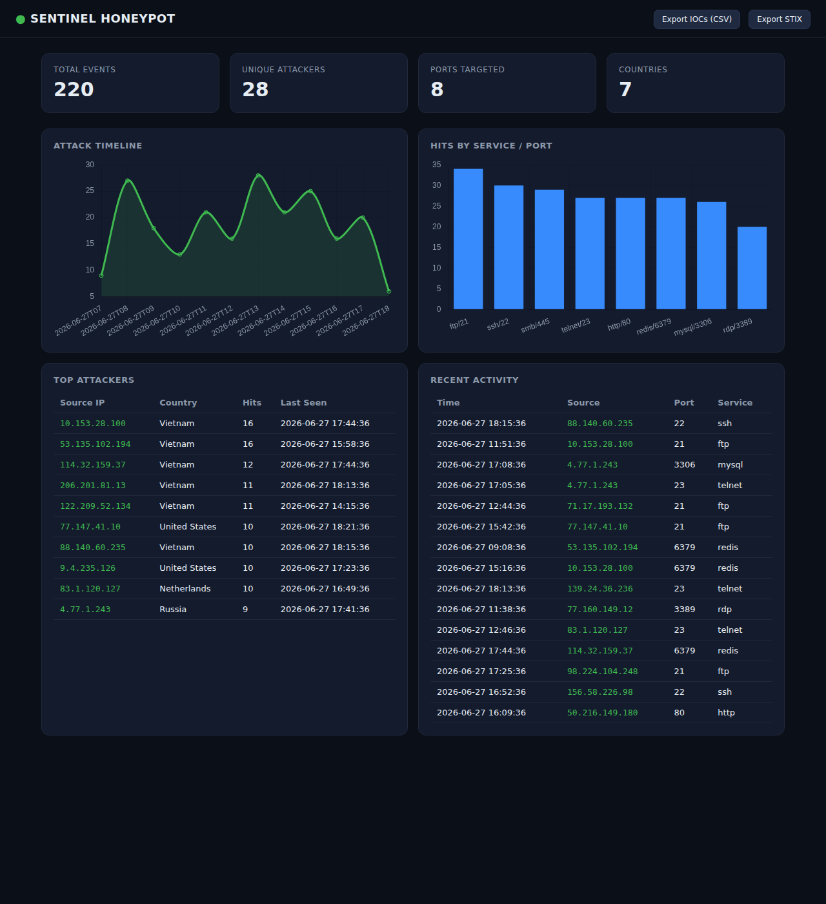

# 🛡️ Sentinel Honeypot

> Multi-port, low-interaction network honeypot with a live SOC dashboard, JSON
> API, geolocation, and threat-intelligence (IOC) export.

[](https://github.com/KristionJones/KristionJones/actions/workflows/honeypot-ci.yml)


**Project 1 of the [Enterprise Security Operations Portfolio](../../README.md).**

Sentinel emulates common services (SSH, Telnet, HTTP, MySQL, SMB, Redis, …)
across many TCP ports, records every connection attempt, and turns that
activity into actionable detection data: live dashboards, top-attacker
rankings, an attack timeline, and exportable indicators of compromise in CSV,
JSON, and STIX 2.1.



---

## ✨ Features

- **Multi-port sensor** — one threaded listener per emulated service; bind
  failures are skipped, not fatal.
- **Low-interaction & safe** — sends a banner, captures a bounded payload,
  closes the socket. Never executes attacker input.
- **Live dashboard** — auto-refreshing HTML UI with timeline and per-service
  charts (Chart.js vendored locally — works air-gapped).
- **JSON API** — `/api/stats`, `/api/events`, `/api/attackers`, `/api/timeline`.
- **Geolocation** — offline classification of private/reserved space; optional
  MaxMind GeoLite2 for country attribution.
- **IOC export** — download indicators as **CSV**, **JSON**, or a **STIX 2.1**
  bundle for ingestion into a SIEM or threat-intel platform.
- **Persistent storage** — thread-safe SQLite event store with SQL-side
  aggregation.
- **Docker-ready** — non-root image, health check, `docker compose up`.
- **Tested** — 33 unit/integration tests, 88% coverage, CI on Python 3.10–3.12.

## 🚀 Quick start

### Local (Python 3.10+)

```bash
cd projects/01-honeypot
pip install -r requirements.txt

# Emulate SSH/Telnet/HTTP on high ports + dashboard on :8080
python -m honeypot --ports 2222,2323,8888 --dashboard-port 8080
```

Open <http://localhost:8080> for the dashboard. Generate some traffic:

```bash
printf 'root\nadmin\n' | nc localhost 2222
curl http://localhost:8080/api/stats
curl "http://localhost:8080/api/iocs?format=stix" -o iocs.json
```

### Docker

```bash
cd projects/01-honeypot
docker compose up --build
# dashboard → http://localhost:8080
# emulated services → 2222 (ssh), 2323 (telnet), 8888 (http)
```

> ⚠️ **Deploy responsibly.** Run only on hosts and networks you are authorized
> to monitor. Exposing emulated services to the internet attracts real attack
> traffic — isolate the host and never co-locate with production systems.

## 🔌 API reference

| Endpoint                       | Description                                        |
|--------------------------------|----------------------------------------------------|
| `GET /`                        | HTML dashboard                                     |
| `GET /healthz`                 | Liveness + event count                             |
| `GET /api/stats`               | Totals, top attackers, by-port, by-country, timeline |
| `GET /api/events?limit=N`      | Most recent events (newest first)                  |
| `GET /api/attackers?limit=N`   | Busiest source IPs                                 |
| `GET /api/timeline?bucket=`    | Counts by `minute` \| `hour` \| `day`              |
| `GET /api/iocs?format=`        | IOC export: `csv` \| `json` \| `stix`              |

## 🧰 CLI

```text
python -m honeypot [options]
  --host HOST              sensor bind address (default 0.0.0.0)
  --ports 22,80,...        ports to emulate (default: built-in service set)
  --db PATH                SQLite path (default honeypot.db; ":memory:" ok)
  --dashboard-host HOST    dashboard bind address
  --dashboard-port PORT    dashboard port (default 8080)
  --geoip-db PATH          optional GeoLite2-Country.mmdb
  --no-dashboard           run the sensor only
  --no-sensor              run the dashboard only
  -v, --verbose
```

## 🏗️ Architecture

See [docs/ARCHITECTURE.md](docs/ARCHITECTURE.md) for the full diagram and design
rationale. In brief: per-port `ThreadingTCPServer` listeners write `Event`s to a
shared, lock-guarded SQLite `EventStore`; a Flask app serves aggregations and
IOC exports computed in SQL.

## 🧪 Testing

```bash
pip install -r requirements-dev.txt
pytest --cov=honeypot --cov-report=term-missing
```

33 tests cover the storage aggregations, geolocation degradation, IOC formats
(including STIX bundle structure), every API route, the CLI parser, and a live
end-to-end sensor capture on an ephemeral port.

## 📁 Layout

```
projects/01-honeypot/
├── honeypot/
│   ├── config.py        # ports → service/banner map, runtime config
│   ├── sensor.py        # multi-port threaded listeners
│   ├── storage.py       # SQLite event store + aggregations
│   ├── geo.py           # offline/GeoLite2 geolocation
│   ├── iocs.py          # CSV / JSON / STIX export
│   ├── dashboard.py     # Flask app factory + JSON API
│   ├── cli.py           # `python -m honeypot`
│   ├── templates/       # dashboard HTML
│   └── static/          # Chart.js (vendored)
├── tests/               # 33 tests
├── docs/                # architecture + screenshots
├── Dockerfile / docker-compose.yml
└── pyproject.toml
```

---

## 💼 Résumé bullet points

- Built a production-grade multi-port network honeypot in Python that emulates
  12+ services, captures attacker payloads safely (low-interaction), and
  persists events to a thread-safe SQLite store with SQL-side aggregation.
- Developed a real-time SOC dashboard (Flask + Chart.js) and JSON API surfacing
  attack timelines, top-attacker rankings, per-service heat, and geolocation.
- Implemented threat-intelligence export of observed indicators to CSV, JSON,
  and **STIX 2.1**, enabling direct ingestion into SIEM/TIP pipelines.
- Achieved 88% test coverage (33 unit/integration tests incl. a live socket
  capture) with GitHub Actions CI across Python 3.10–3.12 and a Docker build.
- Containerized the sensor as a hardened non-root image with health checks for
  one-command (`docker compose up`) deployment.

## 🔗 LinkedIn project description

**Sentinel Honeypot — Network Deception & Threat-Intel Sensor**
Designed and built a low-interaction honeypot that emulates common attack
surfaces (SSH, Telnet, HTTP, MySQL, SMB, Redis) and converts hostile traffic
into defensible data. Features a live dashboard, JSON API, IP geolocation, and
one-click IOC export to CSV/JSON/STIX 2.1 for SIEM ingestion. Fully tested
(88% coverage), CI/CD via GitHub Actions, and Docker-deployable. Demonstrates
blue-team engineering, detection data modeling, and threat-intelligence
workflows. *Python · Flask · SQLite · Docker · STIX/TAXII · MITRE-aligned.*

## 📄 License

[MIT](LICENSE) © 2026 Kristion Jones
