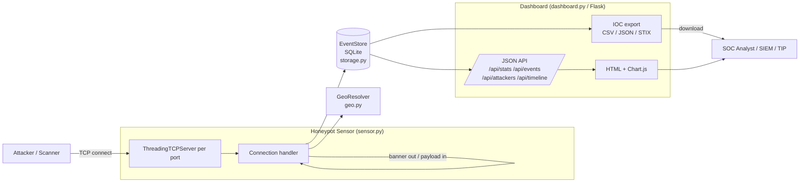

# Architecture — Sentinel Honeypot

## Overview

Sentinel is a **low-interaction** honeypot. It emulates services across many
TCP ports, records every connection attempt (source, target port, captured
payload, geolocation), and serves the data through a live dashboard and JSON
API. It never executes attacker input and never exposes a real shell, so it is
safe to deploy on an isolated host or in a DMZ as an early-warning sensor.

## Components

| Module          | Responsibility                                                                 |
|-----------------|--------------------------------------------------------------------------------|
| `config.py`     | Port → service/banner map and runtime settings (`HoneypotConfig`).             |
| `sensor.py`     | One `ThreadingTCPServer` per port. Sends banners, captures bounded payloads, writes `Event`s. |
| `storage.py`    | Thread-safe SQLite store with all dashboard aggregations (top attackers, timeline, by-port, by-country). |
| `geo.py`        | IP geolocation. Classifies private/reserved space offline; uses MaxMind GeoLite2 if available. |
| `iocs.py`       | Exports indicators as CSV, JSON, or a STIX 2.1 bundle.                          |
| `dashboard.py`  | Flask application factory exposing the JSON API and the HTML dashboard.         |
| `cli.py`        | `python -m honeypot` entry point; wires the sensor and dashboard together.      |

## Design decisions

- **Low interaction by design.** Capturing a bounded number of bytes and
  closing the socket keeps the attack surface minimal — the honeypot is a
  *sensor*, not a sandbox. This is the right trade-off for an early-warning
  blue-team tool.
- **One SQLite store, shared safely.** A single `EventStore` is shared between
  listener threads and the Flask app. Writes are serialized with a lock and the
  connection uses `check_same_thread=False`, avoiding a heavier database
  dependency while staying correct under concurrency.
- **Aggregation lives in SQL.** Top attackers, per-port counts, and the
  timeline are computed with `GROUP BY` queries rather than in Python, so the
  dashboard stays responsive as the event table grows.
- **Graceful geo degradation.** The system never hard-fails on a missing GeoIP
  database; it still distinguishes lab/internal noise from internet sources.
- **Bind failures don't abort the sensor.** Privileged or already-bound ports
  are skipped with a warning so the honeypot starts on whatever it can.

## Data model

A single `events` table:

| column           | meaning                                  |
|------------------|------------------------------------------|
| `timestamp`      | ISO-8601 UTC time of the connection      |
| `src_ip`/`src_port` | attacker source                       |
| `dst_port`       | targeted (bound) port                     |
| `service`        | emulated service name                     |
| `bytes_received` | size of captured payload                  |
| `payload`        | captured bytes (latin-1, bounded)         |
| `session_id`     | per-connection id                         |
| `country` / `country_code` | geolocation result              |

## Deployment

Run the container with `docker compose up`, mapping emulated service ports and
the dashboard. Persist `/app/data` to keep the event database across restarts.
For internet-facing use, place it on an isolated host and forward the ports you
want to monitor (e.g. publish host 22/23/80 to the container's emulated ports).
